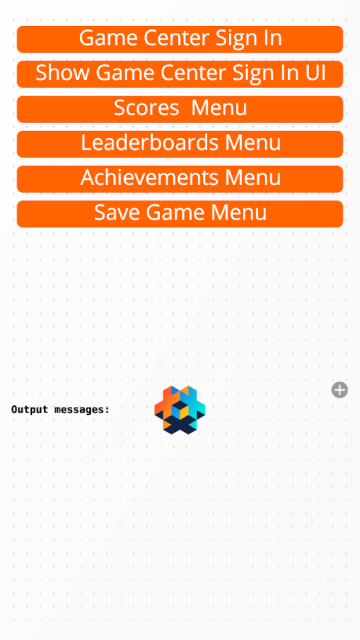

# Defold Apple GameKit Extension
[Defold](https://www.defold.com) native extension for [Apple GameKit Framework.](https://developer.apple.com/documentation/gamekit?language=objc) GameKit is the Apple framework that integtates Apple Game Center features like achievements, leaderboards and online matches into your macOS and iOS games.

## Status
Currently functional Defold extension but not completed.  
Integrated functional GameKit features so far: Players, Leaderboards, Achievements, View Controllers and Errors.  
Possible GameKit features to be integrated: Real-Time Matches, Challenges, Player Invitations, Notifications, Entitlements, Turn-based Games and Save Game Data.

## Requirements
GameKit native extension supports macOS and iOS Defold apps.  
[Apple Developer Program Membership.](https://developer.apple.com/programs/whats-included/)  
[Setup Game Center for your app on Apple App Store Connect.](https://developer.apple.com/library/archive/documentation/LanguagesUtilities/Conceptual/iTunesConnectGameCenter_Guide/Introduction/Introduction.html#//apple_ref/doc/uid/TP40013726)  

## Setup
Include the GameKit extension in your Defold project by adding it as a [Defold library dependency.](http://www.defold.com/manuals/libraries/)  
Open your `game.project` file in the dependencies field under project add:

    https://github.com/animonger/extension-gamekit/archive/master.zip

## Example Lua Code
Examples of the GameKit Lua calls to Game Center can be found in the [game_center.script](https://github.com/animonger/extension-gamekit/blob/master/main/game_center.script) of the Defold GameKit Test example app:  

# Lua GameKit Reference
### Usage
Example call: `gamekit.gc_send("score", {leaderboardID="your_gc_leaderboardID", value=323, context=42, callback=on_scores})`  
(namespace) `gamekit.` (function) `gc_send(` (command) `"score",` (parameters table) `{`(param key) `leaderboardID=` (param value) `"your_gc_leaderboardID"})`  

* [**Initialize**](README.md#initialize-local-player)  
* [**Scores**](README.md#scores)  
* [**Leaderboards**](README.md#leaderboards)  

### Initialize Local Player
Before you can make any calls to Game Center you must authenticate the local player first by calling:  
`gamekit.gc_signin(on_gc_signin)`   
This function takes one parameter (Lua callback fuction) to receive Game Center signin events.  
**Callback Events:**  
`event.type == "error"`, (number) `event.errorCode` and (string) `event.description`   
`event.type == "showSignInUI"`, (string)`event.description`  
`event.type == "authenticated"`, (string)`event.localPlayerID`, (string)`event.localPlayerAlias` and (boolean)`event.localPlayerIsUnderage`  
Call `gamekit.gc_signin()` only one time after your game launches; each time your game moves from the background to the foreground, GameKit automatically authenticates the local player again.  
If the local player has not previously signed in to Game Center your game will receive `event.type == "showSignInUI"`  
Call `gamekit.gc_show_signin("UI")` when convenient to allow local player to sign into Game Center. This function takes one string ("UI") parameter.

### Scores
Before you can send and get Game Center scores in your game, you must configure Leaderboards in [App Store Connect.](https://appstoreconnect.apple.com)  

**gamekit.gc_send("score", {parms})** - Send local player's score to Game Center leaderboard.  
`gamekit.gc_send("score", {leaderboardID="your_gc_leaderboardID", value=323, context=42, callback=on_scores})`  
**Parameters Table Keys:**  
(string) **leaderboardID** – A unique Game Center leaderboard identifier string you created for your game on App Store Connect.  
(number) **value** – A score number value earned by the local player. You determine how your scores are formatted when you define the leaderboard on App Store Connect.  
(number) **context** (optional key) – A number value used by your game. The context property is stored and returned to your game, but is otherwise ignored by Game Center. It allows your game to associate an arbitrary 64-bit unsigned integer value with the score data reported to Game Center. You decide how this context value is interpreted by your game.  
(function) **callback** – A Lua function to receive callback events.  
**Callback Events:**  
`event.type == "error"`, (number) `event.errorCode` and (string) `event.description`  
`event.type == "success"`, (string)`event.description`  

**gamekit.gc_get("scores", {parms})** - Get player scores from Game Center leaderboard.  
`gamekit.gc_get("scores", {leaderboardID="your_gc_leaderboardID", playerScope="Global", timeScope="AllTime", range={1,5}, callback=on_scores})`  
**Parameters Table Keys:**  
(string) **leaderboardID** – A unique Game Center leaderboard identifier string you created for your game on App Store Connect.  
(string) **playerScope** – A filter string used to get scores for players on Game Center. `playerScope=”Global”` or `playerScope=”FriendsOnly”`. “Global” will get all player’s scores and “FriendsOnly” will only get local player’s friends scores.  
(string) **timeScope** – A filter string used to get scores that were posted to Game Center within a specific period of time. `timeScope=”Today”` or `timeScope=”Week”` or `timeScope=”AllTime”`. “Today” will get player scores recorded in the past 24 hours, “Week” will get player scores recorded in the past week, “AllTime” will get player scores recorded for all time.  
(table) **range** – A filter table of minimum and maximum numbers used to get scores within a specific range that were posted to Game Center. `range={minimum, maximum}`, the minimum range number is 1 and the maximum range number is 100. For example, if you specified a range of {1,10}, you would get the top ten scores from first to tenth.  
(function) **callback** – A Lua function to receive callback events.  
**Callback Events:**  
`event.type == "error"`, (number) `event.errorCode` and (string) `event.description`  
`event.type == "scoresList"`, (string) `event.leaderboardTitle`, (string) `event.leaderboardGroupID`, (number) `event.leaderboardMaxRange`, (table `event.localPlayerScore`, (string) `event.localPlayerScore.playerAlias`, (string) `event.localPlayerScore.playerDisplayName`, (string) `event.localPlayerScore.playerID`, (string) `event.localPlayerScore.leaderboardID`, (number) `event.localPlayerScore.rank`, (string) `event.localPlayerScore.formattedValue`, (number) `event.localPlayerScore.value`, (number) `event.localPlayerScore.context`, (string) `event.localPlayerScore.date`, (number) `event.scoresCount`, (table) `event.scores`, (string) `event.scores[i].playerAlias`, (string) `event.scores[i].playerDisplayName`, (string) `event.scores[i].playerID`, (string) `event.scores[i].leaderboardID`, (number) `event.scores[i].rank`, (string) `event.scores[i].formattedValue`, (number) `event.scores[i].value`, (number) `event.scores[i].context` and (string) `event.scores[i].date`  

### Leaderboards
Before you can add Game Center Leaderboards in your game, you must configure Leaderboards in [App Store Connect.](https://appstoreconnect.apple.com)  

**gamekit.gc_show("leaderboardsUI", {parms})** - Show Game Center Leaderboards UI.  
`gamekit.gc_show("leaderboardsUI", {leaderboardID="your_gc_leaderboardID", timeScope="AllTime"})`  
**Parameters Table Keys:**  
(string) **leaderboardID** – A unique Game Center leaderboard identifier string you created for your game on App Store Connect.  
(string) **timeScope** – A filter string used to get scores that were posted to Game Center within a specific period of time. `timeScope=”Today”` or `timeScope=”Week”` or `timeScope=”AllTime”`. “Today” will get player scores recorded in the past 24 hours, “Week” will get player scores recorded in the past week, “AllTime” will get player scores recorded for all time.  
**Callback Events:** none  

**gamekit.gc_get("leaderboards", {parms})** - Get Game Center Leaderboards.  
`gamekit.gc_get("leaderboards", {callback=on_leaderboards})`  
**Parameters Table Key:**  
(function) **callback** – A Lua function to receive callback events.  
**Callback Events:**  
`event.type == "error"`, (number) `event.errorCode` and (string) `event.description`  
`event.type == "leaderboardsList"`, `(number) event.leaderboardsCount`, (table) `event.leaderboards`, (string) `event.leaderboards[i].leaderboardTitle`, (string) `event.leaderboards[i].leaderboardID` and (string) `event.leaderboards[i].leaderboardGroupID`  

**gamekit.gc_get("defaultLeaderboardID", {parms})** - Get Game Center default leaderboardID.  
`gamekit.gc_get("defaultLeaderboardID", {callback=on_leaderboards})`  
**Parameters Table Key:**  
(function) **callback** – A Lua function to receive callback events.  
**Callback Events:**  
`event.type == "error"`, (number) `event.errorCode` and (string) `event.description`  
`event.type == "defaultLeaderboardID"`, (string) `event.leaderboardID`  

**gamekit.gc_send("setDefaultLeaderboardID", {parms})** - Set Game Center default leaderboardID.  
`gamekit.gc_send("setDefaultLeaderboardID", {leaderboardID="your_gc_leaderboardID", callback=on_leaderboards})`  
**Parameters Table Keys:**  
(string) **leaderboardID** – A unique Game Center leaderboard identifier string you created for your game on App Store Connect.  
(function) **callback** – A Lua function to receive callback events.  
**Callback Events:**  
`event.type == "error"`, (number) `event.errorCode` and (string) `event.description`  
`event.type == "success"`, (string)`event.description`  

**gamekit.gc_get("leaderboardImage", {parms})** - Get Game Center Leaderboard image. 
`gamekit.gc_get("leaderboardImage", {leaderboardID="your_gc_leaderboardID", callback=on_leaderboards})`  
**Parameters Table Keys:**  
(string) **leaderboardID** – A unique Game Center leaderboard identifier string you created for your game on App Store Connect.  
(function) **callback** – A Lua function to receive callback events.  
**Callback Events:**  
`event.type == "error"`, (number) `event.errorCode` and (string) `event.description`  
`event.type == "leaderboardImage"`, (string) `event.leaderboardID`, (table) `event.image`, (number) `event.image.width`, (number) `event.image.height` and (bitmap) `event.image.buffer`  

**gamekit.gc_get("leaderboardSets", {parms})** - Get Game Center Leaderboard Sets.  
`gamekit.gc_get("leaderboardSets", {callback=on_leaderboards})`  
**Parameters Table Key:**  
(function) **callback** – A Lua function to receive callback events.  
**Callback Events:**  
`event.type == "error"`, (number) `event.errorCode` and (string) `event.description`  
`event.type == "leaderboardSetsList"`, `(number) event.leaderboardSetsCount`, (table) `event.leaderboardSets`, (string) `event.leaderboardSets[i].leaderboardTitle`, (string) `event.leaderboardSets[i].leaderboardID` and (string) `event.leaderboardSets[i].leaderboardGroupID`  

**gamekit.gc_get("leaderboardsInLeaderboardSet", {parms})** - Get Game Center Leaderboards in Leaderboard Sets.  
`gamekit.gc_get("leaderboardsInLeaderboardSet", {leaderboardSetID="your_gc_leaderboardSetID", callback=on_leaderboards})`  
**Parameters Table Keys:**  
(string) **leaderboardSetID** – A unique Game Center leaderboard set identifier string you created for your game on App Store Connect. 
(function) **callback** – A Lua function to receive callback events.  
**Callback Events:**  
`event.type == "error"`, (number) `event.errorCode` and (string) `event.description`  
`event.type == "leaderboardsList"`, `(number) event.leaderboardsCount`, (table) `event.leaderboards`, (string) `event.leaderboards[i].leaderboardTitle`, (string) `event.leaderboards[i].leaderboardID` and (string) `event.leaderboards[i].leaderboardGroupID`  

**gamekit.gc_get("leaderboardSetImage", {parms})** - Get Game Center Leaderboard Set image.  
`gamekit.gc_get("leaderboardSetImage", {leaderboardSetID="your_gc_leaderboardSetID", callback=on_leaderboards})`  
**Parameters Table Keys:**  
(string) **leaderboardSetID** – A unique Game Center leaderboard set identifier string you created for your game on App Store Connect.  
(function) **callback** – A Lua function to receive callback events.  
**Callback Events:**  
`event.type == "error"`, (number) `event.errorCode` and (string) `event.description`  
`event.type == "leaderboardSetImage"`, (string) `event.leaderboardSetID`, (table) `event.image`, (number) `event.image.width`, (number) `event.image.height` and (bitmap) `event.image.buffer`  

